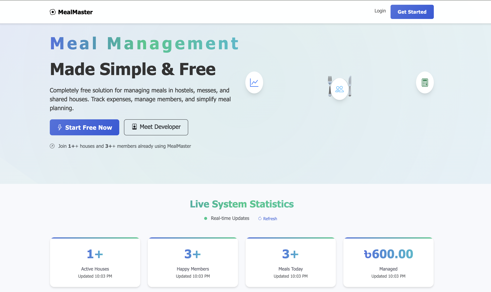
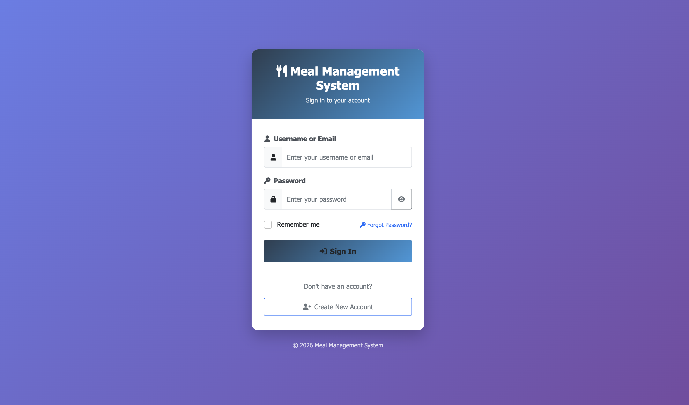
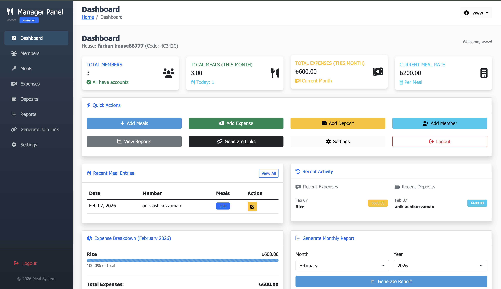
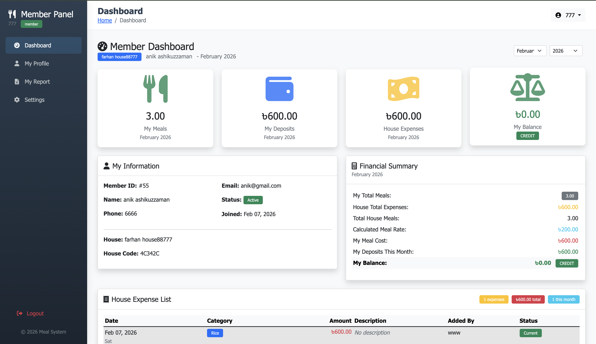
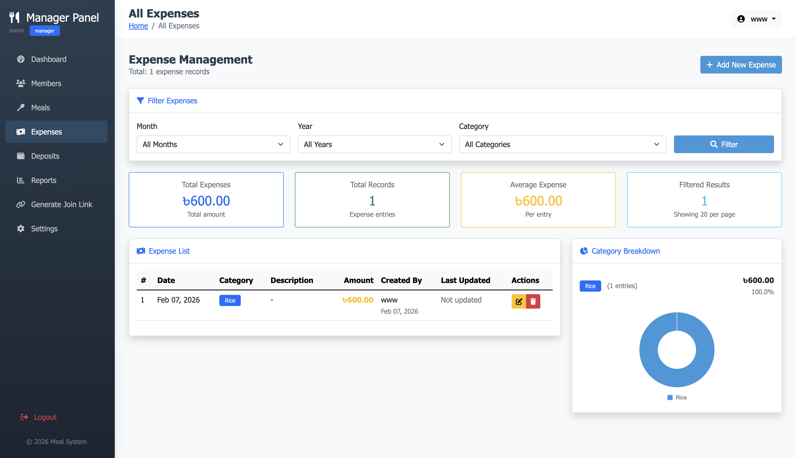
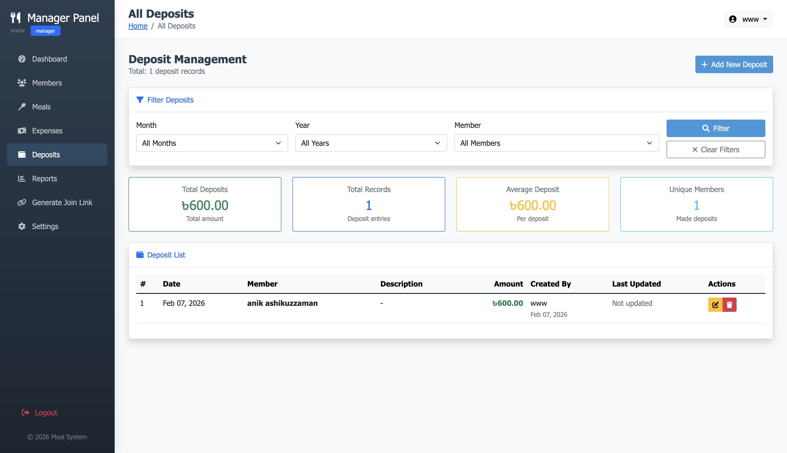
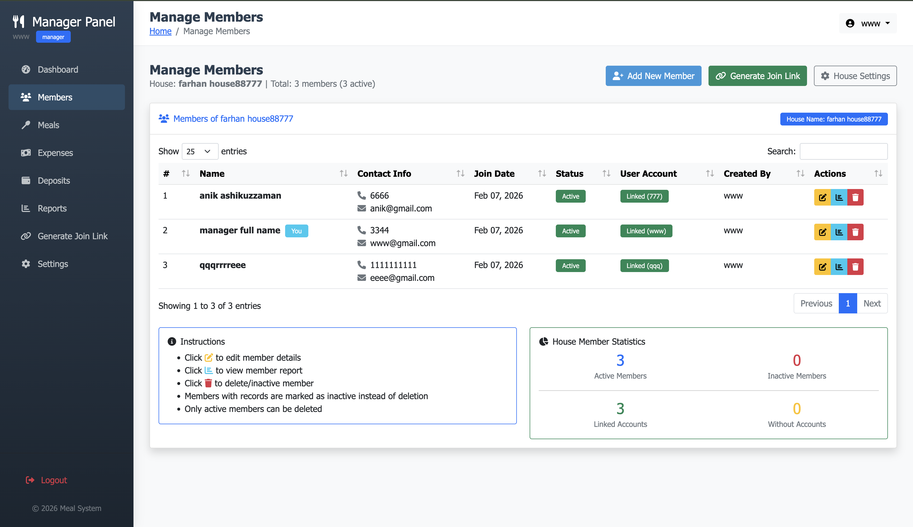
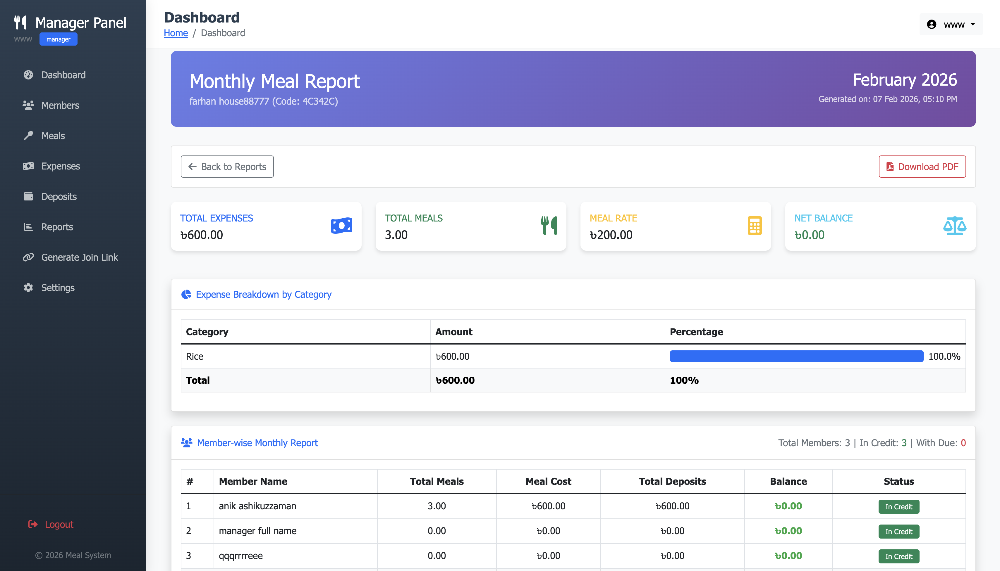
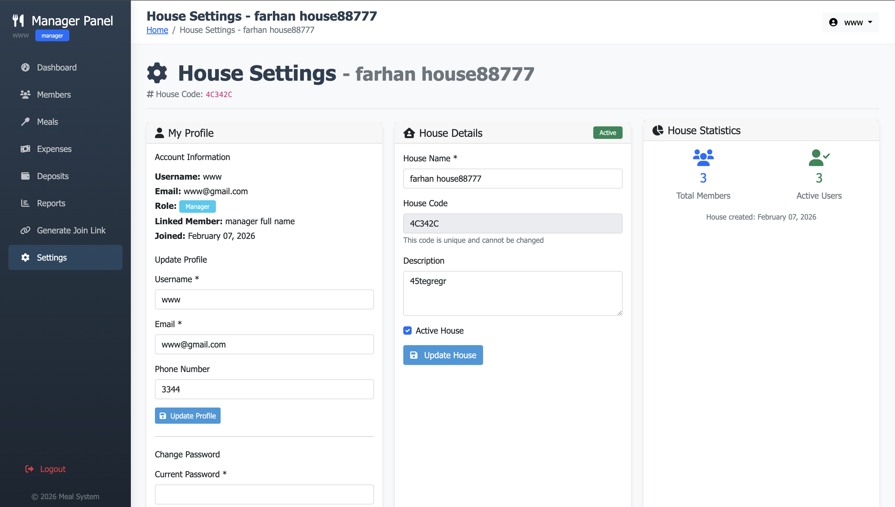
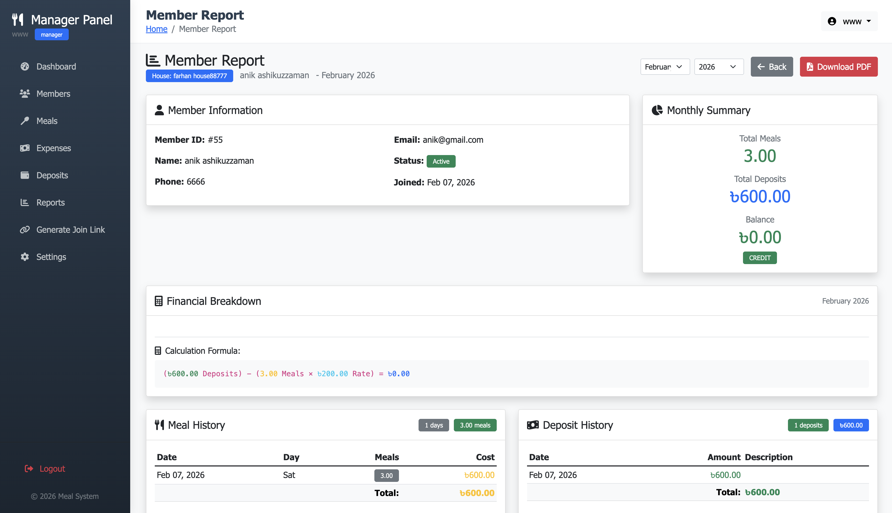

# Meal Management System

A comprehensive web-based application for managing meals in hostels, messes, and shared houses. Track expenses, manage members, calculate meal rates, and simplify meal planning with detailed reports.

## 🌟 Features

### Core Features

- **Multi-role Authentication**: Super Admin, Manager, and Member roles with secure login
- **House Management**: Create and manage multiple houses/messes
- **Meal Tracking**: Record and track daily meals for all members
- **Expense Management**: Categorized expense tracking (Rice, Fish, Meat, Vegetables, Gas, Internet, Utility, Others)
- **Deposit Management**: Track member deposits and payments
- **Monthly Reporting**: Generate detailed monthly reports with cost calculations
- **Real-time Statistics**: Live dashboard with system-wide statistics
- **PDF Generation**: Export reports in PDF format

### Manager Features

- Add/remove members
- Generate member invite links
- Manage meal records
- Handle expenses and deposits
- Generate monthly reports
- House settings management

### Member Features

- View personal meal history
- Track deposits and balance
- View house expenses
- Download personal reports
- Profile management

### Security Features

- Password hashing with bcrypt
- CSRF protection
- Session management
- Security questions for password recovery
- Role-based access control

## 🚀 Getting Started

### Prerequisites

- PHP 7.4 or higher
- MySQL 5.7 or higher
- Apache/Nginx web server
- Bootstrap 5 (included via CDN)
- Font Awesome (included via CDN)

### Installation

1. **Clone or download the project**

   ```bash
   cd /Applications/XAMPP/xamppfiles/htdocs/mealing_online
   ```

2. **Start Apache and MySQL** in XAMPP control panel

3. **Access the setup page**
   Open your browser and navigate to:

   ```
   http://localhost/mealing_online/setup.php
   ```

4. **Follow the setup wizard**
   - The system will automatically create the database and tables
   - Default credentials will be created

### Default Login Credentials

After setup, you can login with:

| Role        | Username   | Password |
| ----------- | ---------- | -------- |
| Super Admin | superadmin | password |
| Manager     | admin      | admin123 |

⚠️ **Important**: Change the default passwords after first login!

## 📁 Project Structure

```
mealing_online/
├── index.php                 # Landing page with system statistics
├── setup.php                 # Database setup and initialization
├── repair_database.php       # Database repair utility
├── README.md                # This file
├── LICENSE                  # License information
│
├── api/
│   └── get_stats.php         # API for fetching real-time statistics
│
├── auth/
│   ├── login.php             # User login page
│   ├── logout.php            # Logout handler
│   ├── register.php          # User registration
│   ├── change_password.php   # Password change
│   ├── forgot_password.php   # Password recovery
│   ├── choose_role.php       # Role selection during registration
│   └── ...
│
├── config/
│   └── database.php          # Database configuration
│
├── database/
│   └── meal_system.sql       # Database schema
│
├── image/
│   └── farhan.png           # Developer profile image
│
├── includes/
│   ├── auth.php             # Authentication class
│   ├── functions.php        # Core functions and helpers
│   ├── header.php           # Common header template
│   ├── footer.php           # Common footer template
│   ├── pdf.php              # PDF generation
│   ├── realtime.php         # Real-time updates
│   ├── generate_monthly_report.php  # Monthly report generator
│   └── generate_member_report.php   # Member report generator
│
├── manager/                  # Manager dashboard and features
│   ├── dashboard.php        # Manager dashboard
│   ├── meals.php            # Meal management
│   ├── add_meal.php         # Add/edit meals
│   ├── expenses.php         # Expense management
│   ├── add_expense.php      # Add expenses
│   ├── deposits.php         # Deposit management
│   ├── members.php          # Member management
│   ├── add_member.php       # Add members
│   ├── monthly_report.php   # Monthly reports
│   ├── member_report.php    # Member-specific reports
│   ├── settings.php         # House settings
│   ├── setup_house.php      # House setup wizard
│   ├── leave_house.php      # Leave house handler
│   ├── generate_link.php    # Generate invite links
│   └── reports.php          # Reports overview
│
└── member/                   # Member dashboard and features
    ├── dashboard.php        # Member dashboard
    ├── report.php           # Personal reports
    ├── profile.php          # Profile management
    ├── settings.php         # Member settings
    ├── register.php         # Member registration via invite
    └── join.php             # Join house via code
```

## 🗃️ Database Schema

### Tables

| Table                    | Description                      |
| ------------------------ | -------------------------------- |
| `houses`                 | Stores house/mess information    |
| `users`                  | User accounts with roles         |
| `members`                | Member profiles linked to houses |
| `meals`                  | Daily meal records               |
| `expenses`               | House expenses with categories   |
| `deposits`               | Member deposits                  |
| `monthly_summary`        | Monthly summary data             |
| `monthly_member_details` | Per-member monthly details       |

### Relationships

```
houses (1) ───> (N) users
houses (1) ───> (N) members
houses (1) ───> (N) meals
houses (1) ───> (N) expenses
houses (1) ───> (N) deposits
houses (1) ───> (N) monthly_summary
members (1) ───> (N) meals
members (1) ───> (N) deposits
```

## 💻 Technology Stack

- **Frontend**: HTML5, CSS3, Bootstrap 5, JavaScript
- **Backend**: PHP 7.4+
- **Database**: MySQL 5.7+
- **Authentication**: bcrypt, sessions, CSRF tokens
- **Reporting**: TCPDF (for PDF generation)
- **Icons**: Font Awesome 6

## 📊 Key Functions

### Authentication (Auth Class)

- `login($username, $password)` - User login
- `register(...)` - User registration
- `logout()` - User logout
- `requireRole($role)` - Role-based access control
- `createHouse(...)` - Create new house
- `joinHouse($code)` - Join existing house

### Functions Class

- `getDashboardStats($month, $year, $house_id)` - Dashboard statistics
- `getSystemStats()` - System-wide statistics
- `calculateMonthlyReport($month, $year, $house_id)` - Monthly report
- `addMeal(...)` - Add meal entry
- `addExpense(...)` - Add expense
- `addDeposit(...)` - Add deposit
- `getExpenseBreakdown($month, $year, $house_id)` - Expense categories
- `formatCurrency($amount)` - Currency formatting
- `exportToCSV($data, $filename)` - CSV export

## 🔧 Configuration

### Database Configuration

Edit `config/database.php`:

```php
define('DB_HOST', 'localhost');
define('DB_USER', 'root');
define('DB_PASS', '');
define('DB_NAME', 'meal_system');
```

### Site Configuration

```php
define('SITE_NAME', 'Meal Management System');
define('BASE_URL', 'http://localhost/mealing_online/');
```

## 📱 User Roles

### Super Admin

- System-wide access
- Manage all houses
- View all reports
- System configuration

### Manager

- Full access to their house
- Manage members
- Add/edit meals, expenses, deposits
- Generate reports
- Settings management

### Member

- View own dashboard
- View personal reports
- View house expenses
- Update profile
- No write access to system data

## 📈 Features Breakdown

### Dashboard

- Total members count
- Monthly meals summary
- Expense tracking
- Current meal rate calculation
- Recent activity feed

### Meal Management

- Add daily meals per member
- Batch meal entry
- Edit/delete meal records
- View meal history

### Expense Management

- Categorized expenses (8 categories)
- Date-based filtering
- Description support
- Visual breakdown

### Deposit Management

- Track member deposits
- Deposit history
- Balance calculation

### Reporting

- Monthly member-wise reports
- Cost calculation
- Balance/Due tracking
- PDF export

## 🔒 Security Measures

1. **Password Security**
   - bcrypt hashing
   - Password reset with security questions

2. **Session Security**
   - Session regeneration on login
   - Secure session handling
   - Session timeout

3. **Input Validation**
   - SQL injection prevention
   - XSS protection
   - CSRF tokens

4. **Access Control**
   - Role-based permissions
   - House-based data isolation

## 🚀 API Endpoints

### GET /api/get_stats.php

Returns real-time system statistics:

```json
{
  "success": true,
  "houses": 5,
  "members": 45,
  "meals": 1250.5,
  "money": 150000.5
}
```

## 📝 Usage Guide

### Setting Up Your House

1. Login with manager credentials
2. Go to Settings → House Settings
3. Update house name and description
4. Add members using "Add Member" button
5. Generate invite links for members

### Daily Workflow

1. **Morning**: Add meal entries for each member
2. **Throughout day**: Record any expenses
3. **When deposits received**: Add deposit records
4. **End of month**: Generate monthly report

### Generating Reports

1. Navigate to Reports section
2. Select month and year
3. Click "Generate Report"
4. Export as PDF or CSV

## 🐛 Troubleshooting

### Database Connection Issues

- Check MySQL service is running
- Verify database credentials in `config/database.php`
- Run `setup.php` to initialize database

### Session Problems

- Clear browser cache and cookies
- Check PHP session configuration
- Ensure session_start() is called

### Permission Errors

- Check file/folder permissions
- Ensure database user has proper privileges
- Verify .htaccess configuration

## 📄 License

This project is open source and available under the MIT License.

## 👨‍💻 Developer

**Kazi Md. Wazeh Ullah Farhan**

- Computer Science & Engineering Student
- American International University-Bangladesh (AIUB)
- 10th Semester, Student ID: 23-50577-1

**Contact:**

- Email: wzullah.farhan@gmail.com
- Phone: +880 1828-658811
- GitHub: https://github.com/wazehfarhan
- LinkedIn: https://www.linkedin.com/in/w2zfrhn

## 📸 Screenshots

### Landing Page


_The landing page displays system statistics and developer information_

### Login Page


_Secure login page with username/password fields_

### Manager Dashboard


_Main dashboard for managers with quick actions and statistics_

### Member Dashboard


_Personal dashboard for members showing their meal and deposit history_

### Meal Management


_Add and manage daily meal entries for all house members_

### Expense Management


_Track categorized expenses (Rice, Fish, Meat, Vegetables, etc.)_

### Deposit Management


_Record and track member deposits_

### Member Management


_Add members and generate invite links_

### Monthly Report


_Generate detailed monthly reports with cost calculations_

### House Settings


_Configure house details and manage settings_

### Member Report


_Personal report view for individual members_

---

## 🙏 Acknowledgments

- Bootstrap 5 for the responsive UI
- Font Awesome for icons
- TCPDF for PDF generation
- All contributors and testers

---

**Version:** 1.0  
**Last Updated:** 2026  
**Built with ❤️ for shared living communities**
